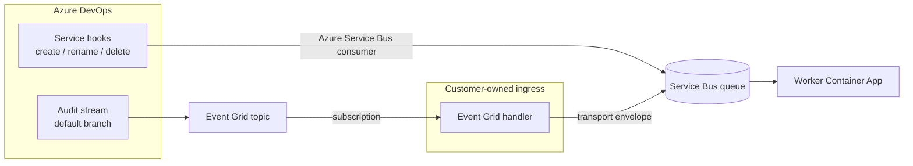

# Event ingestion setup

Operator guide for provisioning **customer-owned queue infrastructure** and **ADO event sources** that deliver repository lifecycle events to the shared Service Bus queue. The worker in this repository only **consumes** that queue; it does not create Service Bus resources, ADO service hooks, or Event Grid topics.

For worker configuration (`SERVICEBUS_CONNECTION_STRING`, transport envelope schema), see **[CONFIGURATION.md](CONFIGURATION.md)**. Canonical requirements live in `openspec/specs/event-ingestion/spec.md` and `openspec/specs/ado-provisioning/spec.md`.

## Architecture

Repository lifecycle events reach **one pre-provisioned Service Bus queue** via two ADO paths. The worker normalizes queue messages and performs Snyk sync.



| ADO lifecycle event | Detection mechanism | Delivery path | Scope |
| ------------------- | ------------------- | ------------- | ----- |
| Repository created | Service hook `git.repo.created` | ADO → Service Bus (direct) | Per project |
| Repository renamed | Service hook `git.repo.renamed` | ADO → Service Bus (direct) | Per project |
| Repository deleted | Service hook `git.repo.deleted` | ADO → Service Bus (direct) | Per project |
| Default branch changed | Audit stream `Git.RepositoryDefaultBranchChanged` | ADO → Event Grid → ingress handler → Service Bus | Organization |

**Service hooks** use ADO's built-in **Azure Service Bus** consumer and publish **directly to the queue** — no webhook receiver in between. **Default branch changes** still flow through Event Grid and a small ingress handler that wraps audit records in the [transport envelope](#transport-envelope).

ADO has **no service hook** for default branch changes. GitHub default branch changes use organization webhooks instead (see `openspec/specs/github-webhook-ingestion/spec.md`).

---

## 1. Service Bus setup

Provision queue infrastructure **outside this repository** before deploying the worker or ingress.

### Create namespace and queue

**Azure Portal**

1. Create an **Azure Service Bus** namespace (Standard or Premium tier).
2. Under **Entities → Queues**, create a queue (for example `repo-sync-events`).
3. Recommended queue settings:
   - **Max delivery count**: `10` (align with worker retry policy when implemented).
   - **Lock duration**: default (`60` seconds) unless messages require longer processing.
   - **Dead-lettering on message expiration**: enabled.
4. Under **Shared access policies**, create or use policies with least privilege:
   - **ADO service hooks**: `Send` only (SAS connection string configured on each hook subscription).
   - **Audit-stream ingress handler**: `Send` only.
   - **Worker**: `Listen` (and `Manage` if the worker dead-letters messages).

**Azure CLI**

```bash
RESOURCE_GROUP=rg-snyk-repo-sync
LOCATION=eastus
NAMESPACE=snyk-repo-sync-sb
QUEUE=repo-sync-events

az group create --name "$RESOURCE_GROUP" --location "$LOCATION"

az servicebus namespace create \
  --resource-group "$RESOURCE_GROUP" \
  --name "$NAMESPACE" \
  --location "$LOCATION" \
  --sku Standard

az servicebus queue create \
  --resource-group "$RESOURCE_GROUP" \
  --namespace-name "$NAMESPACE" \
  --name "$QUEUE" \
  --max-delivery-count 10 \
  --enable-dead-lettering-on-message-expiration true
```

### Connection strings

Retrieve connection strings from **Settings → Shared access policies** (or via CLI):

```bash
az servicebus namespace authorization-rule keys list \
  --resource-group "$RESOURCE_GROUP" \
  --namespace-name "$NAMESPACE" \
  --name RootManageSharedAccessKey \
  --query primaryConnectionString \
  --output tsv
```

Store secrets in Key Vault or your Container App secret store. **Never** commit connection strings to source control.

| Consumer | Variables / secrets |
| -------- | ------------------- |
| Worker | `SERVICEBUS_CONNECTION_STRING`, `SERVICEBUS_QUEUE_NAME` |
| ADO service hooks | Send-capable SAS connection string and queue name (configured on each subscription) |
| Audit-stream ingress handler | Send-capable connection string and queue name |

---

## 2. Queue message formats

The worker consumes messages from a single queue, but **message shape depends on the source path**.

### Service hooks (direct from ADO)

ADO's **Azure Service Bus** consumer sends the **native service hook JSON** directly to the queue ([Microsoft docs](https://learn.microsoft.com/en-us/azure/devops/service-hooks/consumers?view=azure-devops)). There is no transport envelope wrapper and no intermediate webhook.

Example queue body for `git.repo.created`:

```json
{
  "id": "a0a0a0a0-bbbb-cccc-dddd-e1e1e1e1e1e1",
  "eventType": "git.repo.created",
  "publisherId": "tfs",
  "resource": {
    "repository": {
      "id": "c2c2c2c2-dddd-eeee-ffff-a3a3a3a3a3a3",
      "name": "Fabrikam-Fiber-Git",
      "project": { "id": "00aa00aa-bb11-cc22-dd33-44ee44ee44ee", "name": "Fabrikam-Fiber-Git" },
      "defaultBranch": "refs/heads/main"
    }
  },
  "createdDate": "2025-06-12T20:22:53.818Z"
}
```

Use the hook **`id`** field for idempotency. See [Service hook events](https://learn.microsoft.com/en-us/azure/devops/service-hooks/events?view=azure-devops) for full payload schemas.

### Audit stream (transport envelope)

Default-branch audit events arrive via Event Grid. The ingress handler MUST wrap each audit record in the transport envelope before publishing to the queue:

| Field | Type | Description |
| ----- | ---- | ----------- |
| `source` | `"ado"` | Event origin |
| `ingressId` | string | Audit record `Id` |
| `receivedAt` | ISO-8601 UTC | When the ingress handler accepted the event |
| `rawPayload` | object | Audit record (same shape as the ADO audit log export) |

Example:

```json
{
  "source": "ado",
  "ingressId": "2516162638822006204;00000064-0000-8888-8000-000000000000;c8cf06d1-d056-4643-807e-38720b986dca",
  "receivedAt": "2026-08-06T17:21:57.799Z",
  "rawPayload": {
    "ActionId": "Git.RepositoryDefaultBranchChanged",
    "ProjectId": "da9734d4-a91a-4f03-814b-ecc721fe24d1",
    "ProjectName": "snykDemoProject",
    "Timestamp": "2026-08-06T17:21:57.7993795Z",
    "Data": {
      "RepoId": "90bd6b5e-0fbd-4edc-a10e-6604fe76027d",
      "RepoName": "juice-shop.git",
      "DefaultBranch": "refs/heads/develop",
      "PreviousDefaultBranch": "refs/heads/master"
    }
  }
}
```

Use the audit record **`Id`** field as `ingressId`. Put the audit fields (not the Event Grid wrapper) in `rawPayload`.

---

## 3. ADO service hooks

Service hooks cover repository **created**, **renamed**, and **deleted** at the **project** level. Each subscription uses the **Azure Service Bus** consumer to publish **directly to the queue** (consumer ID `azureServiceBus`, action ID `serviceBusQueueSend`).

Configure one subscription per event type per project (or automate via pipeline script — see `openspec/specs/ado-provisioning/spec.md`).

### Prerequisites

- ADO project with Git repositories
- Service Bus queue already created (see [§ 1](#1-service-bus-setup))
- SAS connection string with **Send** permission on the queue or namespace

### Events to subscribe

| UI label | Event ID | Publisher ID |
| -------- | -------- | ------------ |
| Repository created | `git.repo.created` | `tfs` |
| Repository renamed | `git.repo.renamed` | `tfs` |
| Repository deleted | `git.repo.deleted` | `tfs` |

Microsoft reference: [Service hook events — Repository created / deleted / renamed](https://learn.microsoft.com/en-us/azure/devops/service-hooks/events?view=azure-devops).

### Portal setup (per project)

1. Open the ADO project → **Project settings** → **Service hooks**.
2. **Create subscription** → service **Azure Service Bus** → **Next**.
3. Select the trigger (**Repository created**, **Repository renamed**, or **Repository deleted**).
4. Leave filters empty to receive all repositories in the project (or restrict by repository if needed) → **Next**.
5. **SAS connection string**: Send-capable connection string for your namespace.
6. **Queue name**: the pre-provisioned queue (for example `repo-sync-events`).
7. **Resource details to send**: **All**.
8. **Test** the subscription, then **Finish**.
9. Repeat for the other two repository lifecycle events.

Microsoft reference: [Service hook consumers — Send a message to a Service Bus queue](https://learn.microsoft.com/en-us/azure/devops/service-hooks/consumers?view=azure-devops).

### REST API example

Create a subscription programmatically (replace placeholders):

```bash
curl -X POST \
  "https://dev.azure.com/{organization}/{project}/_apis/hooks/subscriptions?api-version=7.1" \
  -u ":{PAT}" \
  -H "Content-Type: application/json" \
  -d '{
    "publisherId": "tfs",
    "eventType": "git.repo.created",
    "resourceVersion": "1.0",
    "consumerId": "azureServiceBus",
    "consumerActionId": "serviceBusQueueSend",
    "publisherInputs": {},
    "consumerInputs": {
      "connectionString": "Endpoint=sb://{namespace}.servicebus.windows.net/;SharedAccessKeyName=...;SharedAccessKey=...",
      "queueName": "repo-sync-events"
    }
  }'
```

Duplicate the request for `git.repo.renamed` and `git.repo.deleted`.

---

## 4. Event Grid and ADO audit stream

Default branch changes are detected **only** via the ADO **audit stream** (organization scope). There is no service hook for this event.

### Prerequisites

- ADO organization backed by **Microsoft Entra ID**
- **Auditing enabled**: Organization settings → **Policies** → enable audit logging (`Policy.LogAuditEvents`)
- Permissions: **Manage audit streams** (Project Collection Administrator or granted explicitly)
- Azure Event Grid **custom topic** using **Event Grid Schema** (not CloudEvents)

### Step 1: Create Event Grid topic

**Azure Portal**

1. **Create a resource** → **Event Grid Topic** (custom topic).
2. On the **Advanced** tab, set **Event Schema** to **Event Grid Schema** (required by ADO).
3. After deployment, copy **Topic Endpoint** and **Access Key 1**.

**Azure CLI**

```bash
az eventgrid topic create \
  --name ado-audit-events \
  --resource-group "$RESOURCE_GROUP" \
  --location "$LOCATION" \
  --input-schema EventGridSchema
```

### Step 2: Connect ADO audit stream to Event Grid

1. Go to `https://dev.azure.com/{organization}` → **Organization settings** → **Auditing**.
2. Open the **Streams** tab → **New stream** → **Event Grid**.
3. Paste the **Topic Endpoint** and **Access Key**.
4. Select **Set up**.

Audit events are **batched** and typically arrive within **30 minutes or less**. An org can have at most **two streams per target type**.

Microsoft reference: [Create audit streaming for Azure DevOps](https://learn.microsoft.com/en-us/azure/devops/organizations/audit/auditing-streaming?view=azure-devops).

### Step 3: Event Grid subscription with filter

Create a subscription on the topic that forwards **default branch changes only**.

| Setting | Value |
| ------- | ----- |
| Event schema | Event Grid Schema |
| Filter type | Advanced filters |
| Key | `data.ActionId` |
| Operator | String equals |
| Value | `Git.RepositoryDefaultBranchChanged` |

Optional additional filter for a single ADO project:

| Key | Value |
| --- | ----- |
| `data.ProjectId` | `{project-guid}` |

**Azure CLI**

```bash
TOPIC_ID=$(az eventgrid topic show \
  --name ado-audit-events \
  --resource-group "$RESOURCE_GROUP" \
  --query id -o tsv)

az eventgrid event-subscription create \
  --name ado-default-branch-to-function \
  --source-resource-id "$TOPIC_ID" \
  --endpoint-type azurefunction \
  --endpoint "/subscriptions/{sub}/resourceGroups/{rg}/providers/Microsoft.Web/sites/{app}/functions/{name}" \
  --advanced-filter data.ActionId StringEquals Git.RepositoryDefaultBranchChanged
```

Replace the endpoint with your Azure Function, webhook, or Logic App URL.

### Step 4: Forward to Service Bus (ingress handler)

Event Grid delivers messages in **Event Grid schema** (`eventType: AzureDevOpsAuditEvent`, audit fields nested under `data`). A direct Event Grid → Service Bus subscription does **not** produce transport envelopes.

Use an ingress component (recommended: **Azure Function** with Event Grid trigger) that:

1. Receives the Event Grid event.
2. Confirms `data.ActionId == "Git.RepositoryDefaultBranchChanged"` (defense in depth if the subscription filter is misconfigured).
3. Builds the transport envelope:
   - `source`: `"ado"`
   - `ingressId`: audit record `data.Id`
   - `receivedAt`: current UTC timestamp
   - `rawPayload`: the audit record object from `data` (same shape as the ADO audit log export)
4. Sends the envelope JSON to the Service Bus queue.

**Audit fields used downstream**

| Field | Use |
| ----- | --- |
| `ProjectId` | ADO scope (`scopeId`) |
| `Data.RepoId` | Repository id |
| `Data.DefaultBranch` | New default branch (`refs/heads/...`) |
| `Data.PreviousDefaultBranch` | Previous default branch |
| `Timestamp` | Event time |

### Verify end-to-end

1. Change a repository default branch in ADO (Branches → **Set as default branch**).
2. Confirm the event appears in **Organization settings → Auditing** with action `Git.RepositoryDefaultBranchChanged`.
3. Within ~30 minutes, check Event Grid topic **Metrics → Publish Success Count**.
4. Confirm your subscription endpoint receives the filtered event.
5. Confirm a transport envelope message appears on the Service Bus queue.
6. Confirm the worker logs receipt (or run integration tests — see **[CONFIGURATION.md § Integration tests](CONFIGURATION.md#integration-tests)**).

---

## Troubleshooting

| Symptom | Likely cause |
| ------- | ------------- |
| Service hook test fails | Invalid SAS connection string; missing Send permission; queue name typo |
| Hook fires but queue empty | Connection string scoped to wrong namespace; queue name mismatch |
| Service hook message rejected by worker | Expected native hook JSON from ADO, not a transport envelope — see [§ 2](#2-queue-message-formats) |
| Audit stream disabled | Auditing policy off; stream access key rotated without updating ADO |
| No Event Grid publishes | Stream not enabled; wrong Event Grid schema (must be Event Grid Schema) |
| Subscription never delivers | Advanced filter key wrong — use `data.ActionId`, not `ActionId` |
| Default branch change in audit log but not on queue | Event Grid subscription missing; ingress handler not republishing; batch delay (wait up to 30 min) |
| Worker dead-letters with `InvalidEnvelope` | Audit message missing transport fields; or service-hook path message mistaken for envelope format |

---

## Related documentation

| Document | Content |
| -------- | ------- |
| **[CONFIGURATION.md](CONFIGURATION.md)** | Worker env vars, CLI, envelope validation |
| **[README.md](README.md)** | Worker install, run, deploy |
| **`openspec/specs/event-ingestion/spec.md`** | Canonical ingress contract |
| **`openspec/specs/ado-provisioning/spec.md`** | ADO provisioning requirements |
| **`data/fixtures/transport_envelope_ado.json`** | Sample wrapped ADO message (audit-path envelope shape) |
