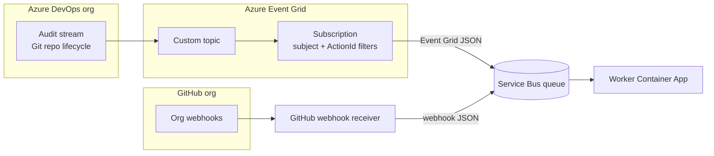

# Event ingestion setup

Operator guide for provisioning **customer-owned queue infrastructure** and **event ingress** that delivers repository lifecycle events to the shared Service Bus queue. The worker in this repository only **consumes** that queue; it does not create Service Bus resources or Event Grid topics.

For worker configuration (`SERVICEBUS_CONNECTION_STRING`, queue message shapes), see **[CONFIGURATION.md](CONFIGURATION.md)**. Canonical requirements live in `openspec/specs/event-ingestion/spec.md` and `openspec/specs/ado-provisioning/spec.md`.

## Architecture

Repository lifecycle events reach **one pre-provisioned Service Bus queue** via ADO audit stream and GitHub organization webhooks. The worker normalizes queue messages and performs Snyk sync.



> **Latency note:** ADO audit events are batched by Azure DevOps and typically delivered within **30 minutes or less**. This is expected behavior, not a misconfiguration. GitHub webhook delivery remains near-real-time.

| ADO lifecycle event | Audit `ActionId` | Path | Scope |
| ------------------- | ---------------- | ---- | ----- |
| Repository created | `Git.RepositoryCreated` | Audit stream → Event Grid → Service Bus | Organization |
| Repository renamed | `Git.RepositoryRenamed` | Audit stream → Event Grid → Service Bus | Organization |
| Repository deleted | `Git.RepositoryDeleted` | Audit stream → Event Grid → Service Bus | Organization |
| Default branch changed | `Git.RepositoryDefaultBranchChanged` | Audit stream → Event Grid → Service Bus | Organization |

All ADO Git repository lifecycle events use the **audit stream** exclusively. GitHub default branch changes use organization webhooks (see `openspec/specs/github-webhook-ingestion/spec.md`).

---

## 1. Service Bus setup

Provision queue infrastructure **outside this repository** before deploying the worker or ingress.

### Create namespace and queue

**Azure Portal**

1. Create an **Azure Service Bus** namespace (Standard or Premium tier).
2. Under **Entities → Queues**, create a queue (for example `repo-sync-events`).
3. Recommended queue settings:
   - **Max delivery count**: `10` (align with worker retry policy when implemented).
   - **Lock duration**: default (`60` seconds) unless messages require longer processing.
   - **Dead-lettering on message expiration**: enabled.
4. Under **Shared access policies**, create or use policies with least privilege:
   - **GitHub webhook ingress**: `Send` only.
   - **Worker**: `Listen` (and `Manage` if the worker dead-letters messages).

**Azure CLI**

```bash
RESOURCE_GROUP=rg-snyk-repo-sync
LOCATION=eastus
NAMESPACE=snyk-repo-sync-sb
QUEUE=repo-sync-events

az group create --name "$RESOURCE_GROUP" --location "$LOCATION"

az servicebus namespace create \
  --resource-group "$RESOURCE_GROUP" \
  --name "$NAMESPACE" \
  --location "$LOCATION" \
  --sku Standard

az servicebus queue create \
  --resource-group "$RESOURCE_GROUP" \
  --namespace-name "$NAMESPACE" \
  --name "$QUEUE" \
  --max-delivery-count 10 \
  --enable-dead-lettering-on-message-expiration true
```

### Connection strings

Retrieve connection strings from **Settings → Shared access policies** (or via CLI):

```bash
az servicebus namespace authorization-rule keys list \
  --resource-group "$RESOURCE_GROUP" \
  --namespace-name "$NAMESPACE" \
  --name RootManageSharedAccessKey \
  --query primaryConnectionString \
  --output tsv
```

Store secrets in Key Vault or your Container App secret store. **Never** commit connection strings to source control.

| Consumer | Variables / secrets |
| -------- | ------------------- |
| Worker | `SERVICEBUS_CONNECTION_STRING`, `SERVICEBUS_QUEUE_NAME` |
| GitHub webhook ingress | Send-capable connection string and queue name |

---

## 2. Queue message shapes

The worker consumes **provider-native JSON** from Service Bus. There is no transport envelope wrapper.

### ADO (Event Grid schema)

Event Grid delivers audit events directly to the Service Bus queue. The message body is Event Grid JSON; the audit record is nested under `data`.

| Field | Use |
| ----- | --- |
| `eventType` | ADO detection (`AzureDevOpsAuditEvent`) |
| `subject` | ADO detection (`AzureDevOps/Auditing`) |
| `data` | Audit record passed to normalization |
| `data.Id` | Event id |
| `data.ActionId` | Lifecycle action |
| `data.ScopeId`, `data.ProjectId`, `data.Data.*` | Normalized org/project/repo/branch |

**Example** (see `data/fixtures/eventgrid_ado_default_branch_changed.json`):

```json
{
  "subject": "AzureDevOps/Auditing",
  "eventType": "AzureDevOpsAuditEvent",
  "data": {
    "Id": "acf86b70-4ec3-4052-9e0b-fbcdd5109c1f",
    "ActionId": "Git.RepositoryDefaultBranchChanged",
    "ScopeId": "c638432a-7f35-450f-984f-372b9d46a376",
    "ScopeDisplayName": "torstencannell (Organization)",
    "ProjectId": "da9734d4-a91a-4f03-814b-ecc721fe24d1",
    "ProjectName": "snykDemoProject",
    "Timestamp": "2026-08-06T17:31:52.3273845Z",
    "Data": {
      "RepoId": "90bd6b5e-0fbd-4edc-a10e-6604fe76027d",
      "RepoName": "juice-shop.git",
      "DefaultBranch": "refs/heads/master",
      "PreviousDefaultBranch": "refs/heads/develop"
    }
  }
}
```

Supported ADO audit `ActionId` values:

| Lifecycle event | `ActionId` |
| --------------- | ---------- |
| Repository created | `Git.RepositoryCreated` |
| Repository renamed | `Git.RepositoryRenamed` |
| Repository deleted | `Git.RepositoryDeleted` |
| Default branch changed | `Git.RepositoryDefaultBranchChanged` |

### GitHub (raw webhook JSON)

GitHub webhook ingress publishes the signed webhook body directly to the queue (see `data/fixtures/github_webhook_created.json`). The worker detects GitHub by top-level `repository` and `action` fields. Normalization is deferred in the current slice.

---

## 3. ADO audit stream and Event Grid

All ADO repository lifecycle events are detected via the **audit stream** (organization scope).

### Prerequisites

- ADO organization backed by **Microsoft Entra ID**
- **Auditing enabled**: Organization settings → **Policies** → enable audit logging (`Policy.LogAuditEvents`)
- Permissions: **Manage audit streams** (Project Collection Administrator or granted explicitly)
- Azure Event Grid **custom topic** using **Event Grid Schema** (not CloudEvents)

### Step 1: Create Event Grid topic

**Azure Portal**

1. **Create a resource** → **Event Grid Topic** (custom topic).
2. On the **Advanced** tab, set **Event Schema** to **Event Grid Schema** (required by ADO).
3. After deployment, copy **Topic Endpoint** and **Access Key 1**.

**Azure CLI**

```bash
az eventgrid topic create \
  --name ado-audit-events \
  --resource-group "$RESOURCE_GROUP" \
  --location "$LOCATION" \
  --input-schema EventGridSchema
```

### Step 2: Connect ADO audit stream to Event Grid

1. Go to `https://dev.azure.com/{organization}` → **Organization settings** → **Auditing**.
2. Open the **Streams** tab → **New stream** → **Event Grid**.
3. Paste the **Topic Endpoint** and **Access Key**.
4. Select **Set up**.

Audit events are **batched** and typically arrive within **30 minutes or less**. An org can have at most **two streams per target type**.

Microsoft reference: [Create audit streaming for Azure DevOps](https://learn.microsoft.com/en-us/azure/devops/organizations/audit/auditing-streaming?view=azure-devops).

### Step 3: Event Grid subscription with filter

Create a subscription on the topic that forwards **Git repository lifecycle events** directly to the Service Bus queue.

| Setting | Value |
| ------- | ----- |
| Event schema | Event Grid Schema |
| Endpoint type | Service Bus queue |
| Filter type | Advanced filters |
| Filter 1 key | `subject` |
| Filter 1 operator | String in |
| Filter 1 values | `AzureDevOps/Auditing` |
| Filter 2 key | `data.ActionId` |
| Filter 2 operator | String in |
| Filter 2 values | `Git.RepositoryCreated`, `Git.RepositoryRenamed`, `Git.RepositoryDeleted`, `Git.RepositoryDefaultBranchChanged` |

Do **not** set `includedEventTypes`; advanced filters alone limit delivery.

Optional additional filter for a single ADO project:

| Key | Value |
| --- | ----- |
| `data.ProjectId` | `{project-guid}` |

**Azure CLI**

```bash
TOPIC_ID=$(az eventgrid topic show \
  --name ado-audit-events \
  --resource-group "$RESOURCE_GROUP" \
  --query id -o tsv)

az eventgrid event-subscription create \
  --name ado-lifecycle-to-servicebus \
  --source-resource-id "$TOPIC_ID" \
  --endpoint-type servicebusqueue \
  --endpoint "/subscriptions/{sub}/resourceGroups/{rg}/providers/Microsoft.ServiceBus/namespaces/{ns}/queues/{queue}" \
  --advanced-filter subject StringIn AzureDevOps/Auditing \
  --advanced-filter data.ActionId StringIn \
    Git.RepositoryCreated \
    Git.RepositoryRenamed \
    Git.RepositoryDeleted \
    Git.RepositoryDefaultBranchChanged
```

Replace the endpoint with your Service Bus namespace and queue resource ID.

### Step 4: Audit fields used downstream

| Field | Use |
| ----- | --- |
| `ScopeId` | ADO org id → normalized `ado.orgId` |
| `ScopeDisplayName` | ADO org display name → normalized `ado.orgDisplayName` |
| `ProjectId` | ADO project id → normalized `scopeId` / `ado.projectId` |
| `ProjectName` | ADO project name → normalized `ado.projectName` |
| `Data.RepoId` | Repository id → normalized `repositoryId` |
| `Data.RepoName` | Repository name → normalized `repository.name` |
| `Data.PreviousRepoName` | Previous repo name on rename → normalized `payload.previousRepoName` |
| `Data.DefaultBranch` | New default branch (`refs/heads/...`) → normalized `payload.defaultBranch` |
| `Data.PreviousDefaultBranch` | Previous default branch → normalized `payload.previousDefaultBranch` |
| `Timestamp` | Event time → normalized `occurredAt` |

See **[CONFIGURATION.md](CONFIGURATION.md)** for the full normalized lifecycle event schema.

### Verify end-to-end

1. Trigger a lifecycle action in ADO (create/rename/delete repo or change default branch).
2. Confirm the event appears in **Organization settings → Auditing** with the expected `ActionId`.
3. Within ~30 minutes, check Event Grid topic **Metrics → Publish Success Count**.
4. Confirm your subscription endpoint receives the filtered event.
5. Confirm an Event Grid JSON message appears on the Service Bus queue.
6. Confirm the worker logs receipt (or run integration tests — see **[CONFIGURATION.md § Integration tests](CONFIGURATION.md#integration-tests)**).

---

## Troubleshooting

| Symptom | Likely cause |
| ------- | ------------- |
| Lifecycle change in audit log but not on queue yet | **Normal batch delay** — wait up to ~30 minutes before investigating further |
| Event on queue hours after the action | Audit stream disabled or Event Grid subscription misconfigured (not latency alone) |
| Audit stream disabled | Auditing policy off; stream access key rotated without updating ADO |
| No Event Grid publishes | Stream not enabled; wrong Event Grid schema (must be Event Grid Schema) |
| Subscription never delivers | Advanced filter key wrong — use `data.ActionId`, not `ActionId` |
| Lifecycle change in audit log but never on queue | Event Grid subscription missing or filters misconfigured |
| Worker dead-letters with `InvalidMessage` | Queue message is not valid Event Grid JSON (ADO) or GitHub webhook JSON |
| Worker dead-letters with `InvalidNormalization` | ADO audit record unsupported or missing required org/project/repo/branch fields |

---

## Related documentation

| Document | Content |
| -------- | ------- |
| **[CONFIGURATION.md](CONFIGURATION.md)** | Worker env vars, CLI, queue message shapes |
| **[README.md](README.md)** | Worker install, run, deploy |
| **`openspec/specs/event-ingestion/spec.md`** | Canonical ingress contract |
| **`openspec/specs/ado-provisioning/spec.md`** | ADO audit stream provisioning requirements |
| **`data/fixtures/eventgrid_ado_default_branch_changed.json`** | Sample ADO Event Grid queue message |
