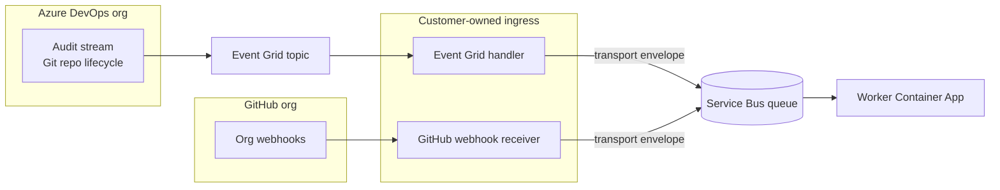

## Context

ADO currently has two documented ingress paths: service hooks (create/rename/delete, direct to Service Bus) and audit stream (default branch only, via Event Grid). Operators validated Event Grid filtering on `data.ActionId = Git.RepositoryDefaultBranchChanged`. Audit stream also emits `Git.RepositoryCreated`, `Git.RepositoryRenamed`, and `Git.RepositoryDeleted` with a consistent schema (`ActionId`, `ProjectId`, `Data.RepoId`, etc.).

All ADO queue messages use the transport envelope; the Event Grid ingress handler wraps audit records before publishing to Service Bus. GitHub continues to use organization webhooks unchanged.

## Goals / Non-Goals

**Goals:**

- Single org-level ADO integration: audit stream → Event Grid → ingress handler → Service Bus.
- One ADO `rawPayload` shape (audit record) for worker normalization.
- Documentation, specs, and architecture diagrams aligned with audit-only ADO ingress.
- Document accepted ~30-minute audit batch latency for operators.

**Non-Goals:**

- GitHub webhook changes.
- Implementing audit normalization in the worker (deferred to a follow-up change if not already in scope).
- Building the Event Grid ingress handler in this repository.
- Reconciliation polling of ADO REST API for missed events.
- Supporting legacy ADO service hook subscriptions.

## Architecture

**Latency:** ADO audit events are batched by Azure DevOps and typically delivered within **30 minutes or less**. This is expected behavior, not a misconfiguration. GitHub webhook delivery remains near-real-time.

| ADO lifecycle event | Audit `ActionId` |
| ------------------- | ---------------- |
| Repository created | `Git.RepositoryCreated` |
| Repository renamed | `Git.RepositoryRenamed` |
| Repository deleted | `Git.RepositoryDeleted` |
| Default branch changed | `Git.RepositoryDefaultBranchChanged` |

Event Grid subscription filter: `data.ActionId` StringIn the four values above. Optional downstream filter by `data.ProjectId` for onboarded scopes.

## Decisions

### 1. Audit stream for all ADO Git lifecycle events

**Decision:** Detect create, rename, delete, and default branch change exclusively via audit stream `ActionId` values.

**Rationale:** One provisioning step per org; one message format; validated Event Grid filter pattern; no per-project service hook maintenance.

**Alternatives considered:**
- Hybrid (service hooks + audit stream for default branch) — rejected; dual paths and message shapes add complexity without product benefit.

### 2. Transport envelope unchanged for ADO

**Decision:** Keep `source`, `ingressId`, `receivedAt`, `rawPayload`. For ADO, `ingressId` = audit record `Id`; `rawPayload` = audit record object (not the Event Grid wrapper).

**Rationale:** Worker envelope parser already validates this shape; ingress handler wraps audit records consistently.

### 3. Audit stream latency (accepted)

**Decision:** Document that ADO audit events are batched and typically arrive within 30 minutes or less. This delay is acceptable for repository lifecycle sync in v1.

**Rationale:** Product confirmed latency is not a blocker. Operators should set expectations; troubleshooting docs must not treat batch delay alone as a failure.

**Documentation requirement:** `INGESTION.md` MUST include a visible latency note in Architecture and Troubleshooting sections.

### 4. Remove service hook artifacts

**Decision:** Delete hook references from docs and specs; replace ADO fixture with audit-based example; update tests accordingly. No `src/` hook code exists today.

## Risks / Trade-offs

| Risk | Mitigation |
| ---- | ---------- |
| ~30-minute audit batch delay | Document as accepted in INGESTION.md; troubleshooting distinguishes delay from misconfiguration |
| Org audit noise | Event Grid `data.ActionId` filter limits to four Git lifecycle events |
| Max 2 audit streams per target type per org | One stream per org is sufficient |
| Existing service hook subscriptions in customer envs | Document decommission in migration plan; no code support for hook-shaped messages |

## Migration Plan

1. Deploy or confirm org-level audit stream and Event Grid subscription with four-ActionId filter.
2. Verify transport envelopes appear on Service Bus for create/rename/delete/default-branch test actions.
3. Decommission per-project ADO service hook subscriptions pointing at the shared queue.
4. Update operator docs and deploy worker/docs changes from this change.

**Rollback:** Re-enable service hooks only if audit stream fails; specs no longer require hook support after this change ships.

## Open Questions

_None — audit-only approach confirmed._
