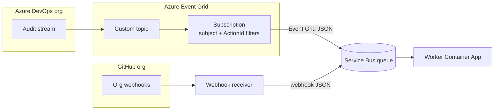

## Context

ADO audit events flow: audit stream → Event Grid custom topic → Event Grid subscription (advanced filters) → Service Bus queue → worker. There is no Azure Function or other ingress component wrapping messages.

The worker currently validates a transport envelope that is not present on the wire. Real queue bodies are Event Grid schema JSON with audit fields nested under `data`. ADO lifecycle normalization (org, project, repo, branch) is already implemented against audit record fields; only the parse layer must change.

GitHub continues to use a signature-validating webhook publish path outside this repository, but queue bodies should be raw webhook JSON—not transport envelopes.

## Goals / Non-Goals

**Goals:**

- Accept native Event Grid JSON for ADO on the Service Bus queue.
- Identify ADO messages when `eventType == "AzureDevOpsAuditEvent"` **or** `subject == "AzureDevOps/Auditing"`.
- Extract audit record from `data` and feed existing ADO normalization.
- Document subscription filters: `subject` + `data.ActionId` (four Git lifecycle values).
- Remove all transport envelope documentation, specs, fixtures, and code.
- Improve worker logging so parsed and normalized fields appear in console output.

**Non-Goals:**

- Legacy transport envelope support.
- ADO ingress Function in this repository.
- GitHub normalization (deferred).
- Snyk sync or sync state.

## Architecture



## Queue message shapes

### ADO (Event Grid schema)

Service Bus message body is Event Grid JSON. Example fields:

| Field | Use |
| ----- | --- |
| `eventType` | ADO detection (`AzureDevOpsAuditEvent`) |
| `subject` | ADO detection (`AzureDevOps/Auditing`) |
| `data` | Audit record passed to normalization |
| `data.Id` | Event id (`eventId`) |
| `data.ActionId` | Lifecycle action |
| `data.ScopeId`, `data.ProjectId`, `data.Data.*` | Normalized org/project/repo/branch |

### GitHub (raw webhook JSON)

Top-level webhook body with `action`, `repository`, `organization`, etc. Worker detects GitHub by webhook shape (no Event Grid wrapper). Normalization deferred in current slice.

## Worker parsing

| Step | Rule |
| ---- | ---- |
| Parse JSON | Message body MUST be a JSON object |
| Detect ADO | `eventType == "AzureDevOpsAuditEvent"` **or** `subject == "AzureDevOps/Auditing"` |
| ADO payload | Audit record = `data` (MUST be an object) |
| Detect GitHub | Top-level `repository` object and string `action` (and not ADO) |
| Unrecognized | Dead-letter `InvalidMessage` |
| Normalize ADO | Existing mapper on audit record; unsupported `ActionId` → `InvalidNormalization` |

Internal parsed model:

```python
@dataclass
class QueueMessage:
    source: Literal["ado", "github"]
    provider_payload: dict  # audit record (ADO) or webhook body (GitHub)
    event_id: str | None     # data.Id (ADO); delivery id future for GitHub
```

## Event Grid subscription filters

Document in `INGESTION.md` (advanced filters only; no `includedEventTypes`):

| Filter | Key | Operator | Values |
| ------ | --- | -------- | ------ |
| Subject | `subject` | String in | `AzureDevOps/Auditing` |
| Lifecycle | `data.ActionId` | String in | `Git.RepositoryCreated`, `Git.RepositoryRenamed`, `Git.RepositoryDeleted`, `Git.RepositoryDefaultBranchChanged` |

**Azure CLI:**

```bash
az eventgrid event-subscription create \
  --name ado-lifecycle-to-servicebus \
  --source-resource-id "$TOPIC_ID" \
  --endpoint-type servicebusqueue \
  --endpoint "/subscriptions/{sub}/resourceGroups/{rg}/providers/Microsoft.ServiceBus/namespaces/{ns}/queues/{queue}" \
  --advanced-filter subject StringIn AzureDevOps/Auditing \
  --advanced-filter data.ActionId StringIn \
    Git.RepositoryCreated \
    Git.RepositoryRenamed \
    Git.RepositoryDeleted \
    Git.RepositoryDefaultBranchChanged
```

## Decisions

### 1. No transport envelope

**Decision:** Remove envelope contract; worker parses provider-native queue bodies.

**Rationale:** Matches deployed infra; avoids untrusted wrapper metadata; audit record is authoritative.

### 2. ADO detection uses OR

**Decision:** Match ADO when `eventType` **or** `subject` indicates auditing (both checked; either sufficient).

**Rationale:** Tolerant if one field is absent; subscription filters still limit queue contents.

### 3. DLQ reason rename

**Decision:** Replace `InvalidEnvelope` with `InvalidMessage` for unparseable or unrecognized shapes.

**Rationale:** No envelope concept remains; breaking change acceptable (no legacy).

### 4. Keep normalization model unchanged

**Decision:** ADO normalization still maps audit `ActionId` → `repo.*` with `ado`, `repository`, and branch `payload`.

**Rationale:** Only input path changes (`data` audit record instead of `rawPayload`).

### 5. Logging includes field values in message text

**Decision:** Log normalized fields in the log message string, not only in `extra`.

**Rationale:** Default `basicConfig` format hides `extra` dict values.

## Risks / Trade-offs

| Risk | Mitigation |
| ---- | ---------- |
| OR detection matches unexpected messages | Require valid `data` audit object; worker allowlist on `ActionId` |
| GitHub shape collision | ADO check runs first; explicit GitHub heuristics |
| Existing queue messages are Event Grid or envelope mix | No legacy support; purge or dead-letter old envelope messages |
| DLQ messages from prior runs | Operator clears or ignores old DLQ entries |

## Migration Plan

1. Deploy worker with native message parsing.
2. Update Event Grid subscription filters to include `subject` (keep `data.ActionId`).
3. Replace fixtures and docs; remove transport envelope references.
4. Verify worker completes Event Grid fixtures and live queue messages.

## Open Questions

_None — direct Event Grid → Service Bus confirmed; ADO detection uses OR per product decision._
