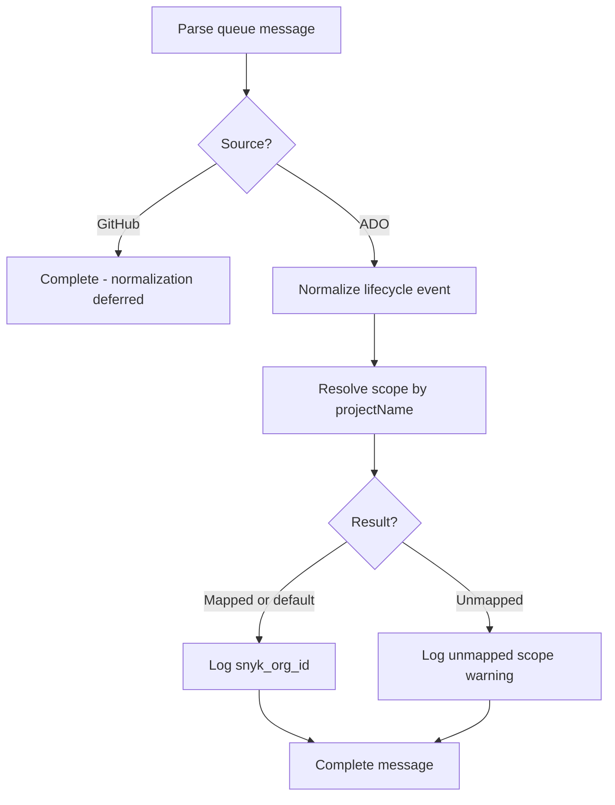

## Context

Slice 3 established unified operator config (`serviceBus`, `syncState`), ADO normalization, and sync-table ensure. Scope-to-Snyk mapping was specified in `openspec/specs/scope-mapping/spec.md` but explicitly deferred.

Operators previously used Table Storage `_meta` rows; that path was removed in slice 3. Mapping must live in mounted `config.yaml`.

## Goals / Non-Goals

**Goals:**

- Declarative ADO project name / GitHub org login → Snyk org id mapping in operator config.
- Startup validation: required fields, non-empty ids, no duplicate lookup keys per source.
- Runtime resolver usable by the worker and (later) Snyk sync logic.
- Unmapped scope: structured log, complete message (no Snyk side effects).

**Non-Goals:**

- Snyk REST API calls (integration lookup, import, deactivate).
- Persisting mappings in Table Storage.
- GitHub normalization (config + resolver support GitHub keys; worker does not normalize GitHub yet).

## Decisions

### Config schema

Top-level optional section `scopeMapping`:

| Key | Required | Description |
| --- | -------- | ----------- |
| `defaultSnykOrgId` | No | Fallback Snyk org id when lookup key has no explicit entry |
| `ado` | No | List of ADO project mappings |
| `github` | No | List of GitHub org mappings |

Each **ADO** list item:

| Key | Required | Description |
| --- | -------- | ----------- |
| `projectName` | Yes | ADO project name — MUST match audit `ProjectName` / normalized `ado.projectName` |
| `snykOrgId` | Yes | Target Snyk organization id |

Each **GitHub** list item:

| Key | Required | Description |
| --- | -------- | ----------- |
| `orgName` | Yes | GitHub organization login |
| `snykOrgId` | Yes | Target Snyk organization id |

Example:

```yaml
scopeMapping:
  defaultSnykOrgId: "00000000-0000-0000-0000-000000000000"  # optional
  ado:
    - projectName: Contoso-Platform
      snykOrgId: "aaaaaaaa-bbbb-cccc-dddd-eeeeeeeeeeee"
  github:
    - orgName: contoso
      snykOrgId: "ffffffff-ffff-ffff-ffff-ffffffffffff"
```

**Validation at startup**

- `scopeMapping` absent or empty → valid; resolver returns unmapped for all lookups unless `defaultSnykOrgId` is set.
- Duplicate `projectName` (case-sensitive) or duplicate `orgName` → `ConfigError`.
- Empty `snykOrgId` or empty lookup key → `ConfigError`.

**Alternative rejected:** Keyed maps (`ado.MyProject.snykOrgId`) — list entries with explicit names are clearer in operator docs and support duplicate detection with stable ordering.

### Env overrides

Scope mappings are config-file only in v1. Unlike Service Bus endpoints, mappings are operator-curated and mounted with the config file; env override adds complexity without a stated need.

### Resolution API

Introduce `src/config/scope_mapping.py` (or adjacent module) with frozen dataclasses:

- `ScopeMappingSettings` — parsed config section
- `ResolvedScopeMapping` — `snyk_org_id`, `resolution` (`mapped` | `default`)
- `UnmappedScope` — `lookup_key`, `source`
- `resolve_scope_mapping(mapping, *, source, lookup_key)` → union result

Lookup keys:

| Source | Key from normalized event (ADO today) |
| ------ | --------------------------------------- |
| `ado` | `ado.project_name` |
| `github` | org login (future; config entries validated at startup) |

When explicit entry is missing and `defaultSnykOrgId` is set → return `ResolvedScopeMapping` with `resolution="default"`.

### Worker flow (slice 4)



No DLQ for unmapped scopes — aligns with slice 3 behavior and `scope-mapping` / `observability` specs.

### Case sensitivity

Lookup keys are case-sensitive to match ADO project names and GitHub logins as returned by providers.

### Snyk org id validation

Non-empty string only at config load time; UUID format validation deferred to Snyk API on the next change.

## Risks / Trade-offs

| Risk | Mitigation |
| ---- | ---------- |
| ADO project rename breaks mapping | Document in CONFIGURATION.md; operator updates config |
| GitHub mapping unused until normalization | Config validated at startup; resolver covered by unit tests |
| Operators expect env override for mappings | Document config-only for v1 |

## Migration Plan

1. Deploy updated worker with optional `scopeMapping` section — existing configs without it continue to log unmapped scopes and complete messages.
2. Operators add `scopeMapping` entries incrementally per ADO project / GitHub org.
3. No Table Storage migration required (mapping never lived there in slice 3).

## Open Questions

_None — case-sensitive lookup and list-based schema adopted per proposal review._
