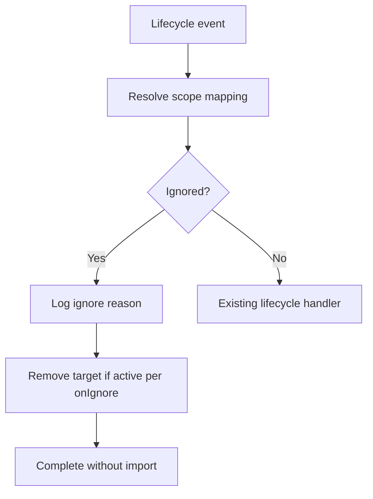

## Context

The `ignored-repos` capability is specified but unimplemented. The canonical spec assumes a JSON file in the git repository and a single prefix regex in operator config. Operators mount non-secret YAML on Azure Files at `/config/config.yaml`; ignore policy should live on the same share. Lifecycle sync, scope mapping, and `snyk.targetRemoval` for rename/delete/branch change are implemented; ignore enforcement is the remaining gap.

## Goals / Non-Goals

**Goals:**

- Declarative ignore policy file (UTF-8 YAML or JSON) referenced from operator config.
- Explicit repo list with required `source`, `owner`, `name`.
- Pattern groups with `filterType` (`regex`, `prefix`, `suffix`) matched against repository name.
- Immediate ignore evaluation on every lifecycle event.
- Background reconciliation for retroactive policy changes and stale active targets.
- Target removal for ignored repos via `snyk.targetRemoval.onIgnore` (default `deactivate`).
- Persist loaded policy to sync state; continue with last good policy on refresh failure.

**Non-Goals:**

- Per-entry removal mode in the ignore file.
- Ignore by branch, file path, or language.
- Separate Container App Job for reconciliation.
- Additional `source` enum values in v1 (`github-enterprise` etc. map to umbrella `github`).

## Decisions

### Policy file location and config reference

| Deployment | Path |
| --- | --- |
| Azure Container Apps | Same Azure Files share as `config.yaml`, e.g. `/config/ignored-repos.yaml` |
| Local dev | `data/ignored-repos.yaml` next to `data/config.yaml` |

```yaml
ignoredRepos:
  path: ignored-repos.yaml              # relative to config file directory
  reconciliationIntervalMinutes: 15     # optional; default 15
```

When `ignoredRepos.path` is unset, ignore enforcement is disabled (current behavior). When set and file is missing at first startup, fail fast with `ConfigError`.

### Format detection and encoding

- Read as **UTF-8** (BOM tolerated; invalid UTF-8 → error).
- Parse by extension: `.yaml`/`.yml` → YAML; `.json` → JSON; otherwise `ConfigError`.
- Both formats MUST represent the same schema.

### Policy file schema

**Top-level keys** (both optional; at least one SHOULD be present when enforcement is enabled):

| Section | Purpose |
| --- | --- |
| `repos` | Explicit `(source, owner, name)` matches |
| `patterns` | Name-based pattern groups |

**`repos[]` entry**

| Field | Required | Used in matching |
| --- | --- | --- |
| `source` | Yes | `azure-repos` or `github` |
| `owner` | Yes | ADO project name or GitHub org login |
| `name` | Yes | Repository name |
| *(any other keys)* | No | Operator context only |

**Source mapping at evaluation time:**

| Worker event source | Ignore entry `source` | Owner field |
| --- | --- | --- |
| `ado` | `azure-repos` | `ado.projectName` |
| `github` | `github` | GitHub org login |

**`patterns[]` group**

| Field | Required | Description |
| --- | --- | --- |
| `id` | Yes | Operator label (e.g. `Disabled`) — for logs only |
| `filterType` | Yes | `regex`, `prefix`, or `suffix` |
| `patterns` | Yes | Non-empty list of strings |

**Matching rules**

- Ignored if **any** explicit entry matches **or** **any** pattern in **any** group matches.
- Explicit match: all three of `source`, `owner`, `name` (case-sensitive, consistent with scope mapping).
- Pattern match: repository **name only** (not owner), all scopes.
- `prefix`: `repo_name.startswith(pattern)`
- `suffix`: `repo_name.endswith(pattern)`
- `regex`: `re.search(pattern, repo_name)` (Python `re` syntax; invalid regex → startup `ConfigError` with group `id`).

**Validation at load**

- Duplicate `(source, owner, name)` → `ConfigError`.
- Unknown `source`, empty `patterns`, unknown `filterType`, missing required fields → `ConfigError`.

### Removal behavior

Extend existing `snyk.targetRemoval`:

```yaml
snyk:
  targetRemoval:
    onRename: deactivate
    onDefaultBranchChange: deactivate
    onRepoDelete: deactivate
    onIgnore: deactivate              # deactivate | delete
```

| Situation | Behavior |
| --- | --- |
| Ignored repo, not in Snyk / no active target | Skip import; complete message |
| Ignored repo, active target in sync state | Remove per `onIgnore` (event-time or reconciliation) |
| repo-created for ignored repo | Complete without import |

### Event-time enforcement (immediate)

Evaluate ignore policy on **every** lifecycle event after scope mapping resolves:

| Event | Ignored? | Action |
| --- | --- | --- |
| **repo.created** | Yes | Complete without import |
| **repo.renamed** | New name matches ignore | Do not import new name; remove old target per `onIgnore` |
| **repo.default_branch_changed** | Yes | Complete without re-import; remove existing target per `onIgnore` if active |
| **repo.deleted** | Yes | Normal delete flow still applies |

Rename-into-ignore is evaluated on the rename event itself, not deferred to reconciliation.

### Background reconciliation

Handles repos that became ignored without a matching lifecycle event (operator added to file, pattern added retroactively):

1. Every `reconciliationIntervalMinutes` (default 15), reload policy file from `ignoredRepos.path`.
2. On success → persist to sync state; on failure → structured log, keep last persisted policy.
3. Scan repository rows with active sync (`importStatus=complete`, active target).
4. For each row matching ignore policy → remove target per `onIgnore`; update state.

Implemented as a background task in the worker process (same Container App). Rationale: co-located with Azure Files mount; no extra infra; complements event-time enforcement.

**Alternative rejected:** Container App Job on a schedule — adds operator setup and splits policy reload from the consumer.

### Module layout

Introduce `src/config/ignored_repos.py`:

- `IgnoredReposSettings` — parsed `ignoredRepos` config section
- `IgnorePolicy` — loaded policy (explicit entries + compiled patterns)
- `IgnoreMatch` — result with reason (`explicit` or pattern group `id`)
- `load_ignore_policy(path) -> IgnorePolicy`
- `is_ignored(policy, *, source, owner, repo_name) -> IgnoreMatch | None`

Persist policy JSON in sync-state `_meta` row (same pattern as other meta concerns).

### Worker flow



## Risks / Trade-offs

| Risk | Mitigation |
| --- | --- |
| Policy file edit breaks YAML/JSON | Startup and reconciliation fail loudly; last good policy retained on refresh failure |
| Regex too broad ignores production repos | Document examples; validate regex at load; log pattern group `id` on match |
| Reconciliation scans many rows | Interval default 15m; only scan `importStatus=complete` rows |
| ADO project name equals GitHub org name | Required `source` disambiguates explicit entries |
| Multiple worker replicas run reconciliation | Accept duplicate work; target removal is idempotent |

## Migration Plan

1. Deploy worker with optional `ignoredRepos.path` — existing configs without it unchanged.
2. Operators upload `ignored-repos.yaml` to Azure Files share and set `ignoredRepos.path` in `config.yaml`.
3. Optionally set `snyk.targetRemoval.onIgnore` (defaults to `deactivate`).
4. No Table Storage schema migration for repository rows; add `_meta` policy blob if not present.

## Open Questions

_None — reconciliation interval defaults to 15 minutes with optional `reconciliationIntervalMinutes` override._
