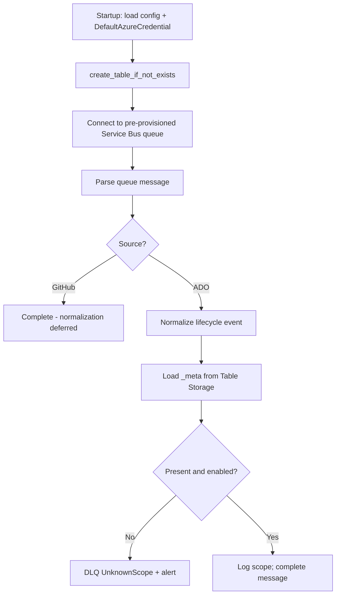

## Context

Slice 2 normalizes ADO lifecycle events and completes messages without storage access. Canonical sync-state schema lives in `openspec/specs/sync-state/spec.md`. The worker currently connects to Service Bus via `from_connection_string` and reads `SERVICEBUS_*` env vars.

This change introduces identity-first Azure access for both Service Bus and Table Storage, a unified operator config file, and slice-3 `_meta` lookup after ADO normalization.

## Goals / Non-Goals

**Goals:**

- Authenticate to Service Bus and Table Storage with `DefaultAzureCredential`.
- Load operator settings from `--config` (default `data/config.yaml`); allow env var overrides with env precedence.
- Ensure sync-state table exists on startup (`create_table_if_not_exists`).
- Connect to a pre-provisioned Service Bus queue (data-plane read/write only).
- After ADO normalization, read `_meta`; DLQ + alert when missing or disabled.
- Document RBAC roles, config schema, and table entity structure for operators.

**Non-Goals:**

- Connection strings, SAS tokens, or storage account keys.
- Service Bus queue or namespace provisioning.
- Snyk API calls, repo lifecycle actions, idempotency enforcement.
- Ignore-list persistence, GitHub normalization, auto `_meta` onboarding.
- Documenting or supporting legacy connection-string auth.

## Decisions

### 1. DefaultAzureCredential for all Azure services

**Decision:** One credential chain for Service Bus and Table Storage.

```python
from azure.identity import DefaultAzureCredential

credential = DefaultAzureCredential()
service_bus = ServiceBusClient(
    fully_qualified_namespace=config.service_bus.fully_qualified_namespace,
    credential=credential,
)
table_service = TableServiceClient(
    endpoint=config.sync_state.storage_account_endpoint,
    credential=credential,
)
```

**Production:** System- or user-assigned managed identity on the Container App.

**Local dev:** `az login`, or a service principal with required RBAC roles.

**Alternative rejected:** Connection strings — secret sprawl, not aligned with Azure best practice.

### 2. Operator config with env overrides

**Decision:** Config file MUST exist at the `--config` path (default `data/config.yaml`). Individual settings MAY be overridden by environment variables; env wins when set.

| Setting | Config key | Env var override |
| ------- | ---------- | ---------------- |
| Service Bus namespace | `serviceBus.fullyQualifiedNamespace` | `SERVICEBUS_FULLY_QUALIFIED_NAMESPACE` |
| Service Bus queue | `serviceBus.queueName` | `SERVICEBUS_QUEUE_NAME` |
| Table endpoint | `syncState.storageAccountEndpoint` | `SYNC_STATE_STORAGE_ACCOUNT_ENDPOINT` |
| Table name | `syncState.tableName` | `SYNC_STATE_TABLE_NAME` |

Default table name when unset: `SnykSyncState`.

**Production:** Mount config at `/config/config.yaml` (Azure Files). Dockerfile passes `--config /config/config.yaml`.

**Alternative rejected:** Env-only startup — operators need a stable mounted config surface for non-secret resource names.

### 3. RBAC roles

| Role | Role ID | Scope | Purpose |
| ---- | ------- | ----- | ------- |
| Azure Service Bus Data Owner | `090c5cfd-121d-4293-81b3-1665f843147` | Namespace or queue | Receive, settle, send messages (data plane) |
| Storage Table Data Contributor | `0a9a7e1f-b9d0-4cc4-a60d-0319b160aaa3` | Storage account or table | `create_table_if_not_exists`, entity CRUD |

Least-privilege alternative: **Azure Service Bus Data Receiver** + **Azure Service Bus Data Sender** on the queue scope.

These roles do NOT grant Service Bus queue creation (control plane). The worker MUST NOT create queues or namespaces.

### 4. Table auto-provision vs Service Bus pre-provision

**Decision:**

- **Table Storage:** `create_table_if_not_exists` on startup.
- **Service Bus:** Connect only; no create/alter/delete of queue infrastructure.

### 5. Unknown / disabled scope handling

| Condition | Action |
| --------- | ------ |
| No `_meta` row | Dead-letter reason `UnknownScope` + operator alert |
| `_meta.enabled == false` | Same |

### 6. Slice-3 worker flow



### 7. Entity property mapping

**`_meta` (ADO):** `PartitionKey=ado:{projectId}`, `RowKey=_meta`

| Property | Type |
| -------- | ---- |
| `snykOrgId` | string |
| `integrationId` | string |
| `integrationType` | string (`ado`) |
| `exclusionGlobs` | string (JSON array) |
| `adoProjectName` | string |
| `enabled` | boolean |

**`_meta` (GitHub):** `PartitionKey=github:{orgId}`, `RowKey=_meta` — same pattern with `githubOrgName`.

**Repository row:** `RowKey={repositoryId}` — `repoName`, `snykTargetId`, `defaultBranch`, `status`, `desiredStateHash`, `lastEventId`, `tagApplied`.

### 8. Dockerfile entrypoint

```dockerfile
ENTRYPOINT ["python", "src/main.py"]
CMD ["worker", "run", "--config", "/config/config.yaml"]
```

## Risks / Trade-offs

| Risk | Mitigation |
| ---- | ---------- |
| Local dev without `az login` | Document prerequisite; clear startup error from credential chain |
| Missing RBAC | Document role assignment checklist in CONFIGURATION.md |
| Config mount missing in prod | Fail fast if `--config` path does not exist |
| Breaking removal of connection strings | No legacy docs; operator guide leads to MI + RBAC + config mount |

## Migration Plan

Not applicable — connection strings are unsupported. Operators deploy with:

1. Pre-provisioned Service Bus queue and storage account.
2. Managed identity with both RBAC roles.
3. Config file mounted at `/config/config.yaml`.
4. Remove any `SERVICEBUS_CONNECTION_STRING` secrets from Container App configuration.

## Open Questions

_None._
